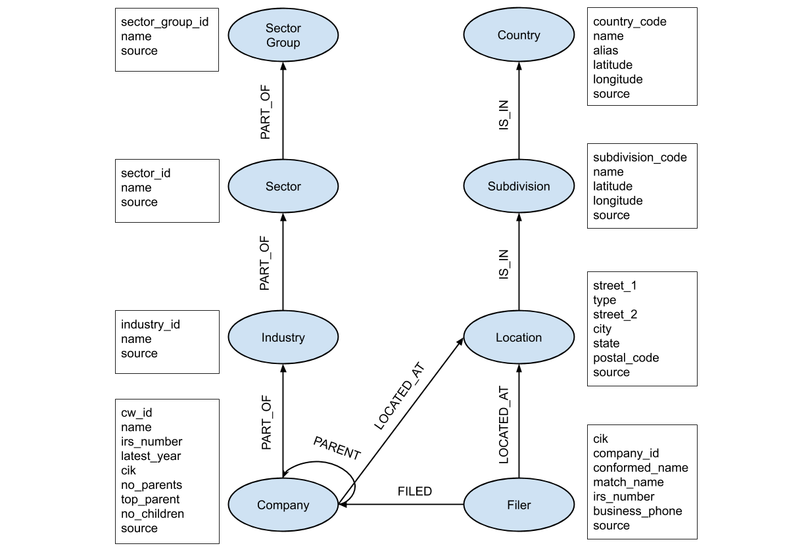

# CorpWatch Companies Graph

## Overview

This page provides instructions and source code for producing a Heterogeneous Information Network of companies and associated information from data obtained from [CorpWatch](https://corpwatch.org/).

## Instructions

**Step 1.** Download the "Dump of entire API database" in CSV format from [here](http://api.corpwatch.org/).

**Step 2.** Run the script `import_data.py` to create the graph as a [NetworkX](https://networkx.github.io/) object. The output can be written as a serialized Python object using pickle or exported in GraphML format.

## Data description

The figure below depicts the schema of the produced graph.

The following table shows the number of graph nodes and edges for each type:

| Node | Number |
| --- | --- |
| Company | 1,175,951 |
| Industry | 487 |
| Sector | 83 |
| Sector Group | 8 |
| Filer | 534,246 |
| Location | 274,283 |
| Subdivision | 1,198 |
| Country | 244 |
| **Total** | **1,986,500** |

| Edge | Number |
| --- | --- |
| part_of(Company, Industry) | 1,089,047 |
| part_of(Industry, Sector) | 484 |
| part_of(Sector, Sector Group) | 83 |
| parent(Company, Company) | 4,008,207 |
| filed(Filer, Company) | 4,251,407 |
| located_at(Company, Location) | 1,862,855 |
| located_at(Filer, Location) | 2,411,350 |
| is_in(Location, Subdivision) | 1,862,855 |
| is_in(Subdivision, Country) | 967 |
| **Total** | **15,487,255** |

More information about the CorpWatch data can be found [here](http://api.corpwatch.org/documentation/faq.html).

