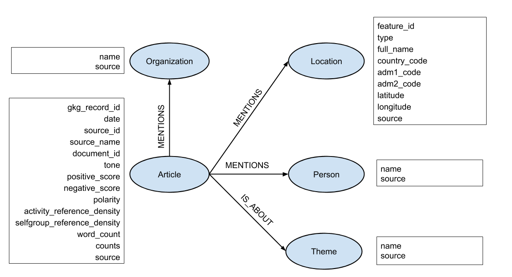

# GDELT Articles Graph

## Overview

This page provides instructions and source code for producing a graph of news articles and associated information about mentioned organizations and persons from data obtained from the [GDELT](https://www.gdeltproject.org/) project.

## Instructions

There are two ways to import data from GDELT:

**A)** Run the script `import_data_from_url.py`, which downloads the list of all available files and the user can then select which ones to fetch. Indicatively, we have downloaded data from the 3rd week (15.Jan - 21.Jan) of 2018. Then, the data is imported into a [NetworkX](https://networkx.github.io/) graph via the NetworkxImporter class, found in the `gdelt_networkx.py` module.

**B)** Run the script `import_data_from_file.py`, where all the data has been already fetched and stored locally. This is done by using a bash script, `fetch_data.sh`. Afterwards, the data is imported into a [NetworkX](https://networkx.github.io/) graph as in the previous case, via the NetworkxImporter.

## Data description

The figure below depicts the schema of the produced graph.

The following table shows the number of graph nodes and edges for each type:
(*NOTE* We took a sample of 664,066 Articles that were stored during the 15.Jan-17.Jan 2018)

| Node | Number |
| --- | --- |
| Article | 664,066 |
| Person | 140,618 |
| Organization | 97,076 |
| Theme | 4,631 |
| Location | 58,738 |
| **Total** | **965,129** |

| Edge | Number |
| --- | --- |
| mentions(Article, Person) | 582,278 |
| mentions(Article, Organization) | 552,812 |
| is_about(Article, Theme) | 1,713,068 |
| mentions(Article, Location) | 6,182,644 |
| **Total** | **9,030,802** |

More information about the GDELT data can be found [here](http://data.gdeltproject.org/documentation/GDELT-Global_Knowledge_Graph_Codebook-V2.1.pdf).
