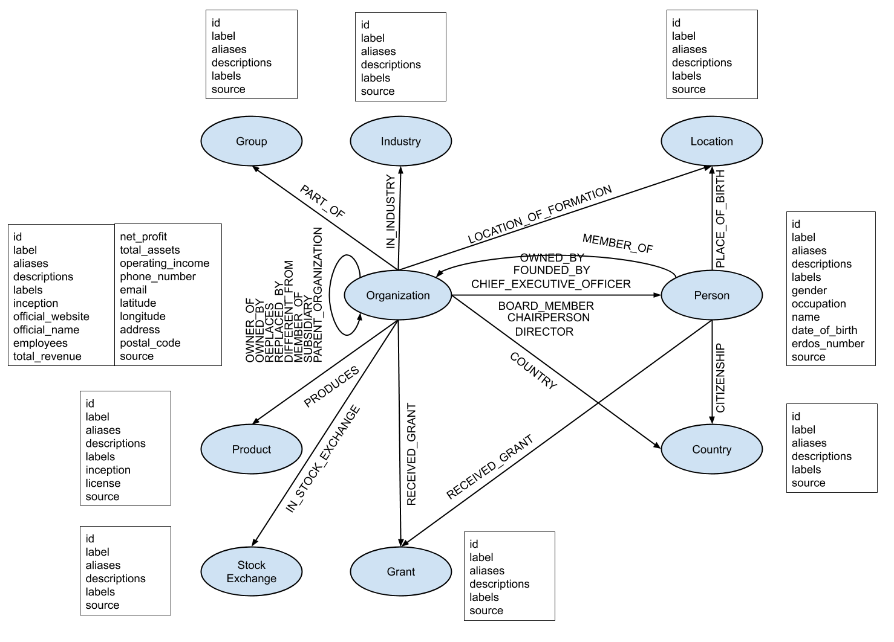

# Wikidata Companies Graph

## Overview

This page provides instructions and source code for producing a Heterogeneous Information Network of companies and associated information from data obtained from [Wikidata](https://www.wikidata.org/wiki/Wikidata:Main_Page).

## Instructions

**Step 1.** Download a JSON dump from [here](https://www.wikidata.org/wiki/Wikidata:Database_download).

**Step 2.** Use the [wdtaxonomy](https://wdtaxonomy.readthedocs.io/en/latest/) tool to identify relevant types of entities (i.e., taxonomy classes). The selected ones are shown in the following table:

| Entity Type | Wikidata Taxonomy ID | Include Descendants |
| --- | --- | --- |
| Country | Q6256 (Country) | No |
| Grant | Q230788 (Grant) | Yes |
| Group | Q16887380 (Group) | No |
| Industry | Q8148 (Industry) | Yes |
| Stock Exchange | Q37654 (Market) & Q43371537 (Trading Venue) | Yes |
| Organization | Q43229 (Organization) | Yes |
| Person | Q5 (Human) | No |
| Product | Q2424752 (Product) | Yes |

**Step 3.** Run the script `collect_ids.sh` to create lists of IDs for the relevant classes to be used for filtering.

**Step 4.** Run `filter_data.py` to keep only the relevant entities. This script uses the `WikidataFilter` class found in the script `wikidata_filter.py` to filter the lines of the original dump into separate files for each entity type. It specifies that filtering is done by `type` and provides the files that contain the Ids of the relevant classes, produced in the previous step. Separate files, corresponding to each entity type, are created, containing the filtered records from the original dump.

**Step 5.** Run `clean_data.py` to transform the entities provided by the previous step from the original JSON format and export it into a CSV format. The script uses the `WikidataCleaner` class in the `wikidata_cleaner.py` to extract all the necessary information. This is done by passing a dictionary indicating the entity types to be extracted and the corresponding files.

**Step 6.** This step imports the data into a [NetworkX](https://networkx.github.io/) graph, by executing the script `import_data.py`. This first creates entities of type *Organization* with all their links (just nodes with ids and edges). Following that, all the files concerning those nodes are imported to expand their information. Finally, the files concerning entities of type *Person* & *Product* are read to expand the corresponding nodes with further information and their links. As a final step, we find which nodes have not been expanded, meaning that they were not included in the original files, thus we need to search again the original dump, now by Ids instead of taxonomies. So, we re-execute steps 4-6 to include them in the graph.

## Data description

The figure below depicts the schema of the produced graph.

The following table shows the number of graph nodes and edges for each type:

| Node | Number |
| --- | --- |
| Organization | 1,599,969 |
| Person | 51,640 |
| StockExchange | 127 |
| Group | 15,738 |
| Industry | 2,141 |
| Location | 15,235 |
| Grant | 6,515 |
| Country | 1,194 |
| Product | 3,832 |
| **Total** | **1,696,391**|

| Edge | Number |
| --- | --- |
| founded_by(Organization,Person) | 28,322 |
| chief_executive_officer(Organization,Person) | 2,296 |
| director(Organization,Person) | 5,865 |
| chairperson(Organization,Person) | 11,131 |
| board_member(Organization,Person) | 781 |
| owner_of(Organization,Organization) | 50,684 |
| parent_organization(Organization,Organization) | 84,138 |
| subsidiary(Organization,Organization) | 67,663 |
| member_of(Organization,Organization) | 24,658 |
| different_from(Organization,Organization) | 11,572 |
| replaced_by(Organization,Organization) | 13,194 |
| replaces(Organization,Organization) | 11,418 |
| owned_by(Organization,Owner) | 30,831 |
| in_stock_exchange(Organization,StockExchange) | 8,494 |
| part_of(Organization,Group) | 52,256 |
| in_industry(Organization,Industry) | 32,238 |
| received_grant(Organization,Grant) | 13,051 |
| location_of_formation(Organization,Location) | 27,986 |
| country(Organization,Country) | 1,185,351 |
| produces(Organization,Product) | 10,991 |
| member_of(Person,Organization) | 11,322 |
| received_grant(Person,Grant) | 33,113 |
| place_of_birth(Person,Location) | 29,932 |
| citizenship(Person,Country) | 36,932 |
| **Total** | **1,815,050**|
